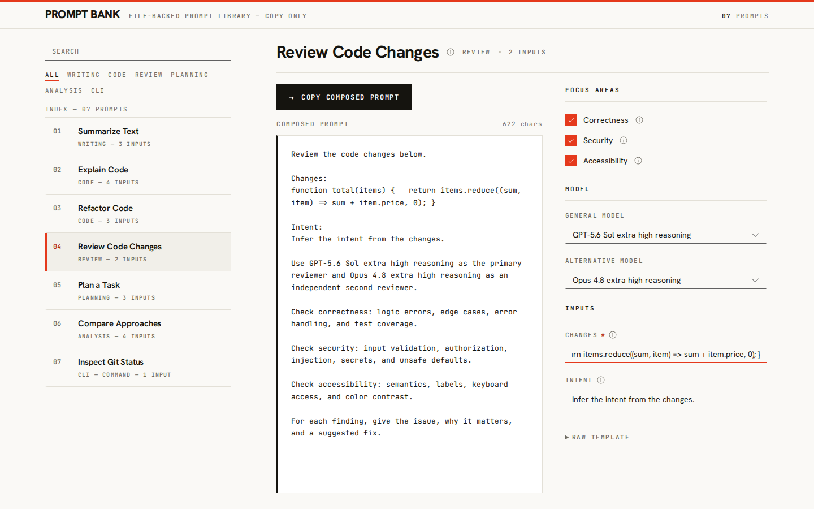

# Prompt Bank

Validated prompts, composed locally, copied anywhere.

Prompt Bank is a local, copy only prompt library. It runs as a desktop app that keeps your prompts on your machine: store them as Markdown, fill their variables and optional sections, preview the composed text, then copy it into any tool. There is no account, no backend, and no model call. Prompt Bank does not send your prompt content anywhere; it leaves the app only when you copy it to your clipboard.



## Why Prompt Bank

- Local and private. Your prompts stay on your machine. Built in prompts ship with the app; your own global and folder prompts are read at runtime and are never bundled or sent anywhere.
- Copy only. Prompt Bank renders and copies text. It never executes a prompt, calls a model, or runs a workflow.
- Structured and validated. Prompts are Markdown files with a small, checked schema, so a broken prompt is caught before you use it.
- Composable. Declare variables, optional focus toggles, and model preset labels, and the composed text updates live.
- Your prompts, together. A personal global set and any folder you open appear alongside the built in prompts, each with a source label.

## Prompt sources

Prompt Bank shows three kinds of prompts together, each with a source label:

- Built in. The prompts that ship with the app.
- Global. Your personal set in `~/.prompt-bank/`. Override the location with the `PROMPT_BANK_HOME` environment variable, which must be an absolute path.
- Folder. A `.prompt-bank/` directory inside any folder you open. Each opened folder becomes its own workspace tab, so you can keep several open at once and switch between them.

Global and folder prompts are read at runtime, only on your machine, and are never bundled into the app or sent over any network.

## Requirements

- Node 20.19 or newer within the Node 20 line, or Node 22.12 or newer. The pinned version is in `.node-version`.
- For the desktop app: the Rust toolchain (via rustup) and your platform's webview libraries. See Building the desktop app.

## Quick start

Install dependencies:

```bash
npm install
```

Run the desktop app, which shows built in, global, and folder prompts:

```bash
npm run desktop:dev
```

Or preview just the built in library in a browser, without the desktop features:

```bash
npm run dev
```

## Commands

| Command | Purpose |
| --- | --- |
| `npm run desktop:dev` | Run the desktop app with built in, global, and folder prompts. |
| `npm run desktop:build` | Build an unsigned desktop bundle for your platform. |
| `npm run dev` | Preview the built in library in a browser. |
| `npm run validate` | Validate every shipped prompt and the model presets. |
| `npm test` | Run the unit tests. |
| `npm run build` | Type check and build the frontend. |
| `npm run e2e` | Run the local Playwright and Axe checks. |
| `npm run check` | Validate, test, and build in one step. |

## Bring your own prompts

You do not edit the app to add prompts. Put Markdown files in either place and they appear with the same interface, variables, optional focus toggles, model preset labels, live preview, and copy:

- Global: `~/.prompt-bank/<category>/your-prompt.md`
- Folder: `<a folder you open>/.prompt-bank/<category>/your-prompt.md`

A minimal prompt looks like this:

```markdown
---
id: my-prompt
title: My Prompt
category: writing
description: What this prompt is for
variables:
  - name: topic
    description: The subject to write about
    required: true
---

Write a short note about {{topic}}.
```

The example prompts under `prompts/` are the built in set and a starting point. See the authoring guide in `docs/authoring.md` and the full contract in `schema.md`. Run `npm run validate` to check the built in set.

## How it works

Prompt Bank is a React and Vite interface inside a Tauri desktop window. The built in prompts are bundled with the app. Your global and folder prompts are read at runtime by a small Rust core, over in process messages, never over a network, and are never written into the app bundle. The folder picker and every private file read happen in Rust; the reader only reads Markdown directly inside a `.prompt-bank` directory, rejects symlinks, and caps how much it will read. The composer substitutes your inputs into the template, applies the enabled focus blocks, and copies the result to your clipboard. There is no backend and no telemetry; your prompt content leaves the app only through the clipboard copy that you trigger.

## Building the desktop app

The desktop app is built with Tauri, so it needs the Rust toolchain and your platform's webview libraries in addition to Node.

- Rust: install via [rustup](https://rustup.rs).
- Linux: `libwebkit2gtk-4.1-dev`, `build-essential`, `libxdo-dev`, `libssl-dev`, `libayatana-appindicator3-dev`, and `librsvg2-dev`.
- Windows: the WebView2 runtime.
- macOS: the Xcode Command Line Tools.

Then build an unsigned bundle for your platform:

```bash
npm run desktop:build
```

This produces the native bundles for whichever operating system you build on:

- Windows: `Prompt Bank_0.1.3_x64-setup.exe` (NSIS) and an `.msi`, under `src-tauri\target\release\bundle\`. WebView2 is preinstalled on Windows 11.
- macOS: `Prompt Bank.app` and a `.dmg`, under `src-tauri/target/release/bundle/`.
- Linux: an `.AppImage` and a `.deb`, under `src-tauri/target/release/bundle/`.

Build on the target operating system itself; cross compiling between them is not supported here. The bundle is unsigned, so on macOS and Windows the system may warn the first time you open a locally built app. Signed and notarized installers are a later step.

On WSL, `linuxdeploy` walks `PATH` and fails on the mounted Windows directories, so build the AppImage with the Windows entries removed from `PATH`:

```bash
PATH=$(printf '%s' "$PATH" | tr ':' '\n' | grep -v '^/mnt/' | paste -sd: -) npm run desktop:build
```

The pure Rust core is tested in CI with `cargo test -p prompt-bank-core`. A native IPC smoke test that exercises the real commands through Tauri's mock runtime runs locally with `cd src-tauri && cargo test`, since it needs the webview libraries to compile.

## Releases

Installers for all three desktop operating systems are built automatically by the `Release` GitHub Actions workflow, which runs `tauri-apps/tauri-action` on macOS, Windows, and Linux runners.

- To cut a release, push a version tag: `git tag v0.1.3 && git push origin v0.1.3`. The workflow creates one release, has every platform job upload its installer to that same release, and then publishes it as the latest release only after all builds succeed. macOS is built for both Apple Silicon and Intel.
- To produce installers without a release, run the workflow manually from the Actions tab (`workflow_dispatch`). The bundles are uploaded as downloadable workflow artifacts.

The produced bundles are the Windows `.exe` (NSIS) and `.msi`, the macOS `.app` and `.dmg`, and the Linux `.AppImage` and `.deb`. They are unsigned for now, so macOS Gatekeeper and Windows SmartScreen may warn on first open; signing is a later step.

## Accessibility

The interface is keyboard reachable, labels its controls, wires validation messages to their fields, and meets common contrast expectations. The local `npm run e2e` checks include an automated accessibility pass over both the built in library and the desktop workspace views.

## Project layout

| Path | Purpose |
| --- | --- |
| `prompts/<category>/*.md` | The built in prompt templates. |
| `model-presets.yaml` | Descriptive model preset labels. |
| `schema.md` | The full prompt file contract. |
| `docs/authoring.md` | A task oriented authoring guide. |
| `src/` | The React and Vite application. |
| `src-tauri/` | The Tauri desktop shell and the pure Rust core. |
| `scripts/validate.ts` | The prompt and preset validator. |
| `tests/` | The local Playwright and Axe suite. |

## Contributing

See [CONTRIBUTING.md](CONTRIBUTING.md). In short, keep prompts free of personal or proprietary content, keep ids stable, and run `npm run validate` before you open a pull request. Private global and folder prompts live outside the repository and are never committed; a boundary guard fails the build if a `.prompt-bank` path is ever tracked.

## Security

Prompt Bank has no backend and no telemetry. Built in prompts are bundled; global and folder prompts are read at runtime by the Rust core and are never bundled or sent anywhere. The folder picker and all private reads run in Rust, which rejects symlinks, keeps reads inside the chosen `.prompt-bank` directory, and caps how much it reads. Command snippets are copied as plain text and are never executed by the app. If you find a security concern, please report it privately through the repository security advisories, or open an issue if it is not sensitive.

## License

Prompt Bank is released under the MIT License. See [LICENSE](LICENSE). Bundled fonts are covered by the SIL Open Font License 1.1; see [THIRD_PARTY_NOTICES.md](THIRD_PARTY_NOTICES.md).
