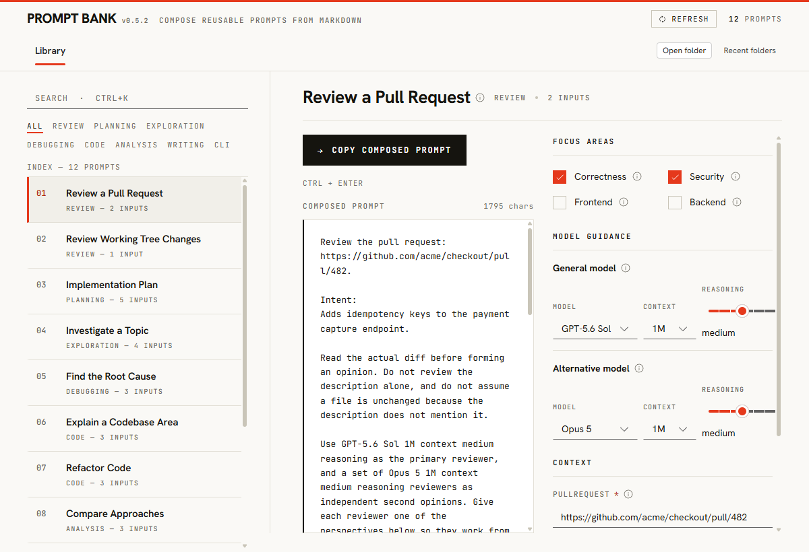

# Prompt Bank

Reusable prompts as local Markdown, composed and ready to paste.

A prompt you rely on tends to exist in a dozen slightly different forms: copies scattered across chats, notes, and gists, each drifting a little from the last. Somewhere along the way a constraint gets dropped, or you paste a stale variant and do not notice until the answer comes back wrong.

Prompt Bank keeps the canonical version in a Markdown file and declares the parts that change as inputs, dropdowns, sliders, and optional sections. The app turns that file into a form: choose the workflow, set the intensity, toggle additive sections, watch the composed text update, then paste it into whichever AI tool you already use.



Because prompts are plain files, they stay yours. You can diff them, grep them, and commit them alongside the project they belong to, with no account and nothing to export if you walk away. Keep a personal set in `~/.prompt-bank/`, and a project specific set in any folder you open. Prompt Bank composes the text and hands it to your clipboard; it does not call a model or send your prompts anywhere.

## Download

Grab an installer from the [latest release](https://github.com/erdemtuna/prompt-bank/releases/latest). No toolchain needed.

| Platform | File |
| --- | --- |
| Windows | `.exe` (NSIS installer) or `.msi` |
| macOS | `.dmg`, built for both Apple Silicon and Intel |
| Linux | `.AppImage` or `.deb` |

The installers are not code signed yet, so the first launch shows a warning you have to click through: on Windows, SmartScreen's "More info" then "Run anyway"; on macOS, right click the app and choose Open, or allow it under System Settings, Privacy and Security. Signing is a later step.

Prefer to build it yourself? See [Building the desktop app](#building-the-desktop-app).

## Why Prompt Bank

- Composable. Declare text inputs, dropdowns, ordered sliders, optional focus toggles, and model preset labels, and the composed text updates live as you fill them in.
- Scope aware. Show, hide, or disable controls from other workflow choices, combine value conditions, and label model guidance by its prompt-specific role.
- Structured. Prompts are Markdown with a small, checked schema, so a malformed prompt is caught before you rely on it.
- Yours to keep. Plain files you can diff, grep, and commit next to the code they belong to. No account, no proprietary format, nothing to migrate later.
- Together in one place. A personal global set and any project folder you open appear alongside the built in prompts, each with a source label.
- Local. Everything happens on your machine. Prompt Bank renders text and copies it; it never executes a prompt, calls a model, or runs a workflow.

## The built in prompts

Twelve prompts ship with the app. They are meant to be useful on their own and to show what the format can do, so most of them address an agent that already has your repository rather than asking you to paste code into a box.

| Prompt | Category | What it is for |
| --- | --- | --- |
| Review a Pull Request | review | Multi-perspective review returning findings with evidence, severity, and a fix |
| Review Working Tree Changes | review | Check your own uncommitted work before it becomes a commit |
| Implementation Plan | planning | Turn an agreed goal into ordered waves with review gates |
| Investigate a Topic | exploration | Explore an area or a question before deciding what to build |
| Find the Root Cause | debugging | Trace a bug to its actual cause, with a regression test |
| Explain a Codebase Area | code | Understand unfamiliar code well enough to change it safely |
| Refactor Code | code | Restructure toward an outcome while behavior stays identical |
| Compare Approaches | analysis | Weigh options against real criteria and commit to one |
| Rewrite for Clarity | writing | Improve writing without replacing the author's voice |
| Summarize a Source | writing | Summarize for a reader who has to act on it |
| New Worktree | cli | A command that sets up a git worktree for parallel work |
| Summarize Branch Diff | cli | A command that prints what this branch changed |

Keyboard: <kbd>Ctrl</kbd>/<kbd>Cmd</kbd>+<kbd>K</kbd> jumps to search, <kbd>Ctrl</kbd>/<kbd>Cmd</kbd>+<kbd>Enter</kbd> copies the composed prompt. Refresh re-reads your prompt files after you edit them on disk.

## Prompt sources

Prompt Bank shows three kinds of prompts together, each with a source label:

- Built in. The prompts that ship with the app.
- Global. Your personal set in `~/.prompt-bank/`. Override the location with the `PROMPT_BANK_HOME` environment variable, which must be an absolute path.
- Folder. A `.prompt-bank/` directory inside any folder you open. Each opened folder becomes its own workspace tab, so you can keep several open at once and switch between them.

Global and folder prompts are read at runtime, only on your machine, and are never bundled into the app or sent over any network.

## Requirements

- Node 20.19 or newer within the Node 20 line, or Node 22.12 or newer. The pinned version is in `.node-version`.
- For the desktop app: the Rust toolchain (via rustup) and your platform's webview libraries. See Building the desktop app.

## Quick start

You only need this section if you want to run from source. To just use the app, see [Download](#download).

Install dependencies:

```bash
npm install
```

Run the desktop app, which shows built in, global, and folder prompts:

```bash
npm run desktop:dev
```

Or preview just the built in library in a browser, without the desktop features:

```bash
npm run dev
```

## Commands

| Command | Purpose |
| --- | --- |
| `npm run desktop:dev` | Run the desktop app with built in, global, and folder prompts. |
| `npm run desktop:build` | Build an unsigned desktop bundle for your platform. |
| `npm run dev` | Preview the built in library in a browser. |
| `npm run validate` | Validate every shipped prompt and the model presets. |
| `npm test` | Run the unit tests. |
| `npm run build` | Type check and build the frontend. |
| `npm run e2e` | Run the local Playwright and Axe checks. |
| `npm run check` | Validate, test, and build in one step. |

## Bring your own prompts

You do not edit the app to add prompts. Put Markdown files in either place and they appear with the same interface, typed inputs, optional focus toggles, model preset labels, live preview, and copy:

- Global: `~/.prompt-bank/<category>/your-prompt.md`
- Folder: `<a folder you open>/.prompt-bank/<category>/your-prompt.md`

A minimal prompt looks like this:

```markdown
---
id: my-prompt
title: My Prompt
category: writing
description: What this prompt is for
variables:
  - name: topic
    description: The subject to write about
    required: true
---

Write a short note about {{topic}}.
```

The example prompts under `prompts/` are the built in set and a starting point. See the authoring guide in `docs/authoring.md` and the full contract in `schema.md`. Run `npm run validate` to check the built in set.

Generic prompt selects and discrete sliders appear first as Workflow, followed by Focus areas, active Model guidance, free-form Context, and the raw template. In Model guidance, each role is the first model-field label rather than a separate card heading, while model context and reasoning are dropdowns. Authors can use `visible_when` to remove irrelevant controls, `enabled_when` to keep an unavailable option visible, compound `{{#when}}` conditions for coordinated choices, and `model_roles` to explain who a model label is intended for. Hidden paths are inactive during composition, and unavailable options are effectively off.

These fields only shape the text that is previewed and copied. Model roles and workflow wording are descriptive metadata, not execution or model-routing configuration.

## How it works

Prompt Bank is a React and Vite interface inside a Tauri desktop window. The built in prompts are bundled with the app. Your global and folder prompts are read at runtime by a small Rust core, over in process messages rather than a network, and are not written into the app bundle. The folder picker and every private file read happen in Rust; the reader only reads Markdown directly inside a `.prompt-bank` directory, rejects symlinks, and caps how much it will read. The composer evaluates control applicability, substitutes active inputs into the template, applies enabled focus blocks, and copies the result to your clipboard. It does not run the prompt, invoke its named agents, or call its model roles. There is no backend and no telemetry, so your prompt content leaves the app only through the clipboard copy that you trigger.

## Building the desktop app

The desktop app is built with Tauri, so it needs the Rust toolchain and your platform's webview libraries in addition to Node.

- Rust: install via [rustup](https://rustup.rs).
- Linux: `libwebkit2gtk-4.1-dev`, `build-essential`, `libxdo-dev`, `libssl-dev`, `libayatana-appindicator3-dev`, and `librsvg2-dev`.
- Windows: the WebView2 runtime.
- macOS: the Xcode Command Line Tools.

Then build an unsigned bundle for your platform:

```bash
npm run desktop:build
```

This produces the native bundles for whichever operating system you build on:

- Windows: `Prompt Bank_<version>_x64-setup.exe` (NSIS) and an `.msi`, under `src-tauri\target\release\bundle\`. WebView2 is preinstalled on Windows 11.
- macOS: `Prompt Bank.app` and a `.dmg`, under `src-tauri/target/release/bundle/`.
- Linux: an `.AppImage` and a `.deb`, under `src-tauri/target/release/bundle/`.

Build on the target operating system itself; cross compiling between them is not supported here. The bundle is unsigned, so on macOS and Windows the system may warn the first time you open a locally built app. Signed and notarized installers are a later step.

On WSL, `linuxdeploy` walks `PATH` and fails on the mounted Windows directories, so build the AppImage with the Windows entries removed from `PATH`:

```bash
PATH=$(printf '%s' "$PATH" | tr ':' '\n' | grep -v '^/mnt/' | paste -sd: -) npm run desktop:build
```

The pure Rust core is tested in CI with `cargo test -p prompt-bank-core`. A native IPC smoke test that exercises the real commands through Tauri's mock runtime runs locally with `cd src-tauri && cargo test`, since it needs the webview libraries to compile.

## Releases

Installers for all three desktop operating systems are built automatically by the `Release` GitHub Actions workflow, which runs `tauri-apps/tauri-action` on macOS, Windows, and Linux runners.

- To cut a release, bump `package.json`, which is also the Tauri application version source, and push a matching version tag, for example `git tag v0.5.4 && git push origin v0.5.4`. Keep the desktop crate version and lockfile entry in sync. The workflow creates one release, has every platform job upload its installer to that same release, and then publishes it as the latest release only after all builds succeed. macOS is built for both Apple Silicon and Intel.
- To produce installers without a release, run the workflow manually from the Actions tab (`workflow_dispatch`). The bundles are uploaded as downloadable workflow artifacts.

The produced bundles are the Windows `.exe` (NSIS) and `.msi`, the macOS `.app` and `.dmg`, and the Linux `.AppImage` and `.deb`. They are unsigned for now, so macOS Gatekeeper and Windows SmartScreen may warn on first open; signing is a later step.

## Accessibility

The interface is keyboard reachable, labels its controls, wires validation messages to their fields, and meets common contrast expectations. <kbd>Ctrl</kbd>/<kbd>Cmd</kbd>+<kbd>K</kbd> focuses the index search and <kbd>Ctrl</kbd>/<kbd>Cmd</kbd>+<kbd>Enter</kbd> copies the composed prompt, both from anywhere in the window. The local `npm run e2e` checks include an automated accessibility pass over both the built in library and the desktop workspace views.

## Project layout

| Path | Purpose |
| --- | --- |
| `prompts/<category>/*.md` | The built in prompt templates. |
| `model-presets.yaml` | Descriptive model preset labels. |
| `schema.md` | The full prompt file contract. |
| `docs/authoring.md` | A task oriented authoring guide. |
| `src/` | The React and Vite application. |
| `src-tauri/` | The Tauri desktop shell and the pure Rust core. |
| `scripts/validate.ts` | The prompt and preset validator. |
| `scripts/generate-social-preview.mjs` | Renders `docs/social-preview.png`, the GitHub link card. |
| `tests/` | The local Playwright and Axe suite. |

## Contributing

See [CONTRIBUTING.md](CONTRIBUTING.md). In short, keep prompts free of personal or proprietary content, keep ids stable, and run `npm run validate` before you open a pull request. Private global and folder prompts live outside the repository and are never committed; a boundary guard fails the build if a `.prompt-bank` path is ever tracked.

## Security

Prompt Bank has no backend and no telemetry. Built in prompts are bundled; global and folder prompts are read at runtime by the Rust core and are never bundled or sent anywhere. The folder picker and all private reads run in Rust, which rejects symlinks, keeps reads inside the chosen `.prompt-bank` directory, and caps how much it reads. Command snippets are copied as plain text and are never executed by the app. If you find a security concern, please report it privately through the repository security advisories, or open an issue if it is not sensitive.

## License

Prompt Bank is released under the MIT License. See [LICENSE](LICENSE). Bundled fonts are covered by the SIL Open Font License 1.1; see [THIRD_PARTY_NOTICES.md](THIRD_PARTY_NOTICES.md).
