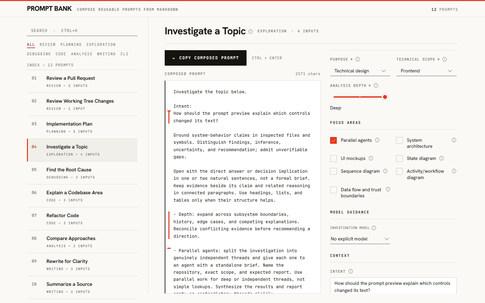

# Prompt Bank

Reusable prompts as local Markdown, composed and ready to paste.

Keep one version of a prompt instead of hunting through old chats and notes. Choose a template, adjust its workflow and context, then copy the result into whichever AI tool you already use.

Your prompts stay on your machine. Prompt Bank does not run them, call a model, or collect telemetry.



## Get the app

Download an installer from the [latest release](https://github.com/erdemtuna/prompt-bank/releases/latest):

**Windows:** `.exe` or `.msi`. **macOS:** `.dmg` for Apple Silicon or Intel. **Linux:** `.AppImage` or `.deb`.

Installers are currently unsigned. Windows and macOS may show warnings; the reported macOS installation problem is tracked in [#21](https://github.com/erdemtuna/prompt-bank/issues/21).

## Use it

1. Pick a prompt from the library or open a project folder.
2. Fill in the context, choose the relevant options, and check the live preview.
3. Copy the composed text and paste it into your AI tool.

Twelve prompts cover reviews, planning, investigations, debugging, refactoring, and writing. Star the ones you use often and find them with the Favorites filter. Model choices shape the copied text; they do not configure or call a provider.

**Ctrl/Cmd+K** jumps to search. **Ctrl/Cmd+Enter** copies the prompt.

See the [usage guide](docs/usage.md) for prompt sources, favorites, and preview markers.

## Add your own prompts

Put Markdown files in `~/.prompt-bank/` for your personal library, or in a project's `.prompt-bank/` folder for that workspace. Press Refresh after editing them.

The [authoring guide](docs/authoring.md) walks through a first prompt. [schema.md](schema.md) contains the exact format and composition rules.

## Run from source

With a supported Node version installed:

```bash
npm ci
npm run dev
```

This opens the browser app with bundled prompts. For the desktop app, platform prerequisites, and build commands, see the [development guide](docs/development.md).

## Project information

See [Contributing](CONTRIBUTING.md) for changes and checks, and the [release guide](docs/releases/README.md) for publishing.

Report security concerns through the repository's [private advisories](https://github.com/erdemtuna/prompt-bank/security/advisories/new).

[MIT license](LICENSE). Bundled fonts have their own [license notices](THIRD_PARTY_NOTICES.md).
